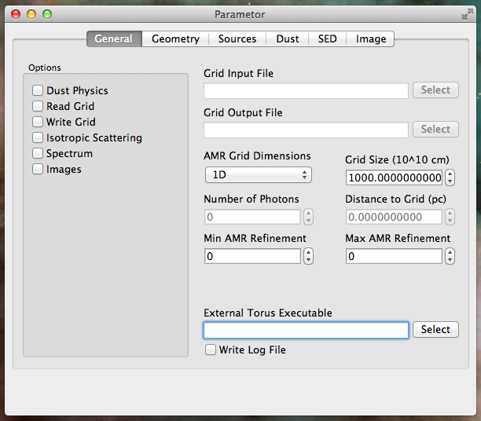

# Parametor - GUI for Torus

**Parametor** is a user-friendly UI for working with the Torus radiative transfer code. 
This GUI helps you view, edit and generate parameters files with which to run Torus. 
Parametor can also help you run Torus locally on your own machine, and monitor the progress of the current execution. Parameter also provides basic analsys of output spectral energy distributions as well as other useful utilities. 

Documentation for the application is available in LaTeX format in the `docs` directory. 
The Torus code was originally written by Prof. Tim Harries and is available at [https://www.astro.ex.ac.uk/people/th2/torus_html/homepage.html](https://www.astro.ex.ac.uk/people/th2/torus_html/homepage.html)

This is written in C++ using the Qt framework. I originally wrote this application in August 2013 while working on a summer project at the University of Exeter performing synthetic observations of the simulations of [Rogers and Pittard (2013)](https://ui.adsabs.harvard.edu/abs/2013MNRAS.431.1337R/abstract). I have since updated the application for newer versions of Qt. 